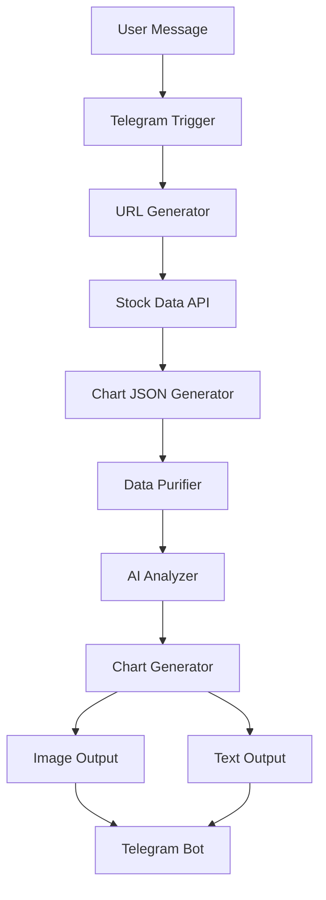

# 📁 Project Structure

This document outlines the organization and structure of the Stock Analyst AI Agent 2.0 repository.

## 📂 Repository Layout

```
stock-analyst-ai-agent/
├── 📄 README.md                           # Main project documentation
├── 📄 LICENSE                            # MIT License
├── 📄 SETUP.md                           # Detailed setup instructions
├── 📄 CONTRIBUTING.md                    # Contribution guidelines
├── 📄 CHANGELOG.md                       # Version history and changes
├── 📄 .gitignore                         # Git ignore patterns
├── 📁 workflow/
│   ├── 📄 Stock_analyst_Ai_Agent_2_0.json # Main n8n workflow file
│   └── 📄 workflow-diagram.png           # Workflow visualization
├── 📁 docs/
│   ├── 📄 API_DOCUMENTATION.md           # API integration details
│   ├── 📄 TROUBLESHOOTING.md            # Common issues and solutions
│   └── 📄 EXAMPLES.md                   # Usage examples
├── 📁 assets/
│   ├── 📄 logo.png                      # Project logo
│   ├── 📄 workflow-screenshot.png       # Workflow screenshot
│   └── 📄 demo-output.png               # Sample output
├── 📁 scripts/
│   ├── 📄 setup.sh                      # Automated setup script
│   └── 📄 validate-config.js            # Configuration validator
└── 📁 templates/
    ├── 📄 bug-report.md                 # GitHub issue template
    ├── 📄 feature-request.md            # Feature request template
    └── 📄 pull-request.md               # PR template
```

## 📄 File Descriptions

### 🏠 Root Directory Files

| File | Description | Purpose |
|------|-------------|---------|
| `README.md` | Main project documentation | Overview, features, installation |
| `LICENSE` | MIT License | Legal usage terms |
| `SETUP.md` | Detailed setup guide | Step-by-step configuration |
| `CONTRIBUTING.md` | Contribution guidelines | How to contribute |
| `CHANGELOG.md` | Version history | Track changes and releases |
| `.gitignore` | Git ignore patterns | Exclude sensitive files |

### 📁 Workflow Directory

Contains the core n8n workflow files and related documentation.

| File | Description | Size |
|------|-------------|------|
| `Stock_analyst_Ai_Agent_2_0.json` | Main n8n workflow | ~15KB |
| `workflow-diagram.png` | Visual workflow representation | Image |

### 📁 Documentation Directory

Additional documentation for advanced users and developers.

| File | Purpose |
|------|---------|
| `API_DOCUMENTATION.md` | Detailed API integration docs |
| `TROUBLESHOOTING.md` | Common issues and solutions |
| `EXAMPLES.md` | Usage examples and tutorials |

### 📁 Assets Directory

Visual assets and media files for the project.

| File | Type | Usage |
|------|------|-------|
| `logo.png` | Image | Project branding |
| `workflow-screenshot.png` | Image | README visual |
| `demo-output.png` | Image | Sample bot output |

### 📁 Scripts Directory

Automation and utility scripts for setup and maintenance.

| File | Purpose |
|------|---------|
| `setup.sh` | Automated installation script |
| `validate-config.js` | Configuration validator |

### 📁 Templates Directory

GitHub issue and PR templates for consistent contributions.

| File | Purpose |
|------|---------|
| `bug-report.md` | Standardized bug reports |
| `feature-request.md` | Feature request format |
| `pull-request.md` | PR template |

## 🔧 Workflow Architecture

### Node Organization

The n8n workflow is organized into logical sections:

```
Workflow Flow:
┌─────────────────┐
│  Input Layer    │ ← GET_Message (Telegram Trigger)
├─────────────────┤
│  Processing     │ ← URL Generator, Data Fetcher
├─────────────────┤
│  AI Analysis    │ ← Google Gemini Models
├─────────────────┤
│  Chart Gen      │ ← Chart-IMG API Integration
├─────────────────┤
│  Output Layer   │ ← Telegram Response (Image + Text)
└─────────────────┘
```

### Key Components

1. **Trigger System**: Telegram webhook for user input
2. **Data Pipeline**: API URL generation and data fetching
3. **AI Processing**: Multiple Gemini models for analysis
4. **Chart Generation**: Professional chart creation
5. **Output System**: Dual-format response delivery

## 📊 Data Flow



## 🔍 File Relationships

### Dependencies
- `README.md` references `SETUP.md` for installation
- `SETUP.md` references `CONTRIBUTING.md` for development
- `CHANGELOG.md` tracks all file modifications
- `.gitignore` protects sensitive configuration files

### Workflow Dependencies
- Main workflow file requires all API credentials
- Documentation files support workflow implementation
- Scripts automate workflow deployment
- Templates standardize community contributions

## 🛠️ Development Structure

### For Contributors
```
Development Workflow:
1. Fork repository
2. Read CONTRIBUTING.md
3. Set up development environment (SETUP.md)
4. Import workflow JSON
5. Make changes
6. Test thoroughly
7. Update documentation
8. Submit pull request
```

### For Users
```
User Workflow:
1. Read README.md
2. Follow SETUP.md
3. Import workflow JSON
4. Configure API keys
5. Test functionality
6. Use the bot
```

## 📱 Mobile-First Structure

The repository structure supports both desktop and mobile development:

- **Responsive documentation** - All markdown files are mobile-friendly
- **Clear navigation** - Logical file organization
- **Quick access** - Important files in root directory
- **Visual aids** - Screenshots and diagrams for clarity

## 🔒 Security Considerations

### File Security
- API keys never committed to repository
- Sensitive data in `.gitignore`
- Example configurations with placeholders
- Security documentation in relevant files

### Access Control
- Public repository for open-source collaboration
- Protected branches for stable releases
- Contributor guidelines for security practices
- Regular security audits and updates

## 🚀 Future Structure Plans

### Planned Additions
```
Upcoming Structure:
├── 📁 tests/                    # Automated testing
├── 📁 configs/                  # Configuration templates
├── 📁 integrations/             # Additional API integrations
├── 📁 examples/                 # More usage examples
└── 📁 mobile/                   # Mobile app companion
```

### Version Control
- Semantic versioning for releases
- Tagged releases for stability
- Branch protection for main branch
- Automated deployment pipelines

## 🎯 Quick Navigation

### For New Users
1. Start with `README.md`
2. Follow `SETUP.md` for installation
3. Import `workflow/Stock_analyst_Ai_Agent_2_0.json`
4. Configure and test

### For Developers
1. Read `CONTRIBUTING.md`
2. Check `CHANGELOG.md` for recent changes
3. Review `docs/` for technical details
4. Use `templates/` for contributions

### For Troubleshooting
1. Check `docs/TROUBLESHOOTING.md`
2. Review GitHub Issues
3. Follow setup guide again
4. Contact maintainers

---

**This structure is designed to be intuitive, scalable, and maintainable for both users and contributors. 🏗️**
