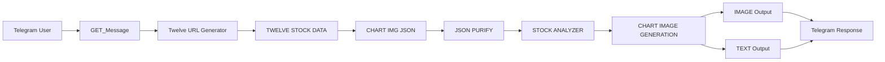

# Stock Analyst Ai Agent
“AI-powered stock analysis workflow using n8n, Gemini, and Telegram integration.”

[](https://n8n.io/)
[](https://ai.google.dev/)
[](https://telegram.org/)
[](https://opensource.org/licenses/MIT)

> **An intelligent, automated stock analysis system that delivers real-time market insights through AI-powered analysis, technical charts, and instant Telegram notifications.**

## 🌟 Overview

The **Stock Analyst AI Agent** is a comprehensive workflow automation system built on n8n that combines real-time stock data, AI-powered analysis, and instant communication to deliver professional-grade market insights directly to your Telegram chat.

### ✨ Key Features

- 🤖 **AI-Powered Analysis**: Leverages Google Gemini 2.5 Flash for intelligent market analysis
- 📊 **Real-Time Data**: Fetches live stock data from Twelve Data API
- 📈 **Technical Charts**: Generates professional TradingView-style charts with Chart-IMG API
- 💬 **Telegram Integration**: Seamless chat interface for instant access
- 🔄 **Automated Workflow**: Fully automated from request to delivery
- 📱 **Multi-Format Output**: Delivers both visual charts and detailed text analysis

## 🏗️ Architecture



## 🚀 How It Works

1. **📱 User Input**: Send a stock ticker symbol via Telegram (e.g., "AAPL", "TATAMOTORS.BSE")
2. **🔗 URL Generation**: AI generates appropriate Twelve Data API URLs
3. **📊 Data Fetching**: Retrieves real-time stock data including OHLC, volume, and metadata
4. **🎨 Chart Creation**: Converts data to TradingView format and generates professional charts
5. **🧠 AI Analysis**: Google Gemini analyzes the data and provides insights
6. **📤 Delivery**: Sends both chart image and detailed analysis back to Telegram

## 🛠️ Tech Stack

| Technology | Purpose | Version |
|------------|---------|---------|
| **n8n** | Workflow Orchestration | Latest |
| **Google Gemini** | AI Analysis Engine | 2.5 Flash |
| **Twelve Data API** | Real-time Stock Data | v1 |
| **Chart-IMG API** | Chart Generation | v2 |
| **Telegram Bot API** | User Interface | Latest |
| **LangChain** | AI Agent Framework | Latest |

## 📋 Prerequisites

Before setting up the workflow, ensure you have:

- ✅ **n8n instance** (self-hosted or cloud)
- ✅ **Google Gemini API key** (Google AI Studio)
- ✅ **Twelve Data API key** (free tier available)
- ✅ **Chart-IMG API key** (for chart generation)
- ✅ **Telegram Bot Token** (via @BotFather)
- ✅ **Basic understanding of n8n workflows**

## 🔧 Installation & Setup

### 1. Clone the Repository
```bash
git clone https://github.com/yourusername/stock-analyst-ai-agent
cd stock-analyst-ai-agent
```

### 2. Import Workflow
1. Open your n8n instance
2. Go to **Workflows** > **Import from file**
3. Upload `Stock_analyst_Ai_Agent.json`
4. Click **Import**

### 3. Configure Credentials

#### Google Gemini API
1. Go to **Settings** > **Credentials**
2. Create **Google Gemini (PaLM) API** credential
3. Add your API key from [Google AI Studio](https://ai.google.dev/)

#### Telegram Bot API
1. Create a new bot via [@BotFather](https://t.me/BotFather)
2. Get your bot token
3. Add **Telegram API** credential in n8n
4. Configure webhook settings

#### API Keys Configuration
Update the following nodes with your API keys:
- **Twelve Data API**: `e2b2120b928e4e97a4bf3c421307613b` (replace with your key)
- **Chart-IMG API**: `pH3B5ZoZz520hI9i39qEBkqEKXUMvXy5oa35N9xi` (replace with your key)

### 4. Activate Workflow
1. Click **Active** toggle in the workflow editor
2. Test with a sample message in Telegram

## 💡 Usage Examples

###  Stock Analysis
```
User:  Stock AAPL for 1 day
Bot: [Sends Apple stock 1 day TF Candelstick chart with RSI/volume profile/ moving avrage crossover indicator + AI overall Technical analysis + Buy-Sell Recomendation]
```


## 📊 Sample Output

When you request stock analysis, the bot delivers:

### 📈 Chart Image


- Professional TradingView-style candlestick chart
- Moving averages (20, 50, 100 periods)
- Volume Profile Visible Range (VPVR)
- Technical indicators and overlays

### 📝 Analysis Report
```
📊 AAPL Stock Summary – July 04, 2025
Exchange: NASDAQ
Interval: 1 Day
Currency: USD
Open Price: $195.30
High Price: $198.50
Low Price: $194.20
Close Price: $197.80
Volume: 45,678,900
Chart Style: Candlestick
Indicators: MACD, Volume Profile

✅ Strong support at $194 level
📉 Resistance near $200 psychological level
✅ Volume above average indicating institutional interest
📈 Moving averages suggest bullish momentum + (Detail Compriensive analysis with Buy and sell recomendatatiion based on the analysis)


This analysis is for educational purposes only.
```

## 🎛️ Node Configuration

### Core Workflow Nodes

| Node | Purpose | Configuration |
|------|---------|---------------|
| **GET_Message** | Telegram trigger | Webhook-based message capture |
| **Twelve URL Generator** | API URL builder | Dynamic URL generation for stock data |
| **TWELVE STOCK DATA** | Data fetching | HTTP requests to Twelve Data API |
| **CHART IMG JSON** | Chart configuration | TradingView format conversion |
| **JSON PURIFY** | Data cleaning | LangChain information extractor |
| **STOCK ANALYZER** | AI analysis | Google Gemini-powered insights |
| **CHART IMAGE GENERATION** | Chart creation | Chart-IMG API integration |
| **IMAGE/TEXT** | Output delivery | Telegram message sending |

### Google Gemini Models
- **4 instances** of Gemini 2.5 Flash
- **Specialized prompts** for each analysis stage
- **Context-aware** responses based on market data

## 🔒 Security & Privacy

- 🔐 **API Keys**: Store securely in n8n credentials
- 🛡️ **Webhook Security**: Use HTTPS endpoints only
- 🔒 **Data Privacy**: No personal data stored permanently
- ⚠️ **Disclaimer**: All analysis is for educational purposes only

## 📚 API Documentation

### Twelve Data API
- **Endpoint**: `https://api.twelvedata.com/time_series`
- **Parameters**: symbol, interval, outputsize, apikey
- **Rate Limits**: 8 requests/minute (free tier)
- **Documentation**: [Twelve Data Docs](https://twelvedata.com/docs)

### Chart-IMG API
- **Endpoint**: `https://api.chart-img.com/v2/tradingview/advanced-chart`
- **Format**: TradingView chart configuration JSON
- **Documentation**: [Chart-IMG Docs](https://chart-img.com/docs)

## 🚨 Troubleshooting

### Common Issues

| Issue | Solution |
|-------|----------|
| **Workflow not triggering** | Check Telegram webhook configuration |
| **API rate limits** | Implement request throttling |
| **Chart generation fails** | Verify Chart-IMG API key and JSON format |
| **AI analysis errors** | Check Google Gemini API quota and permissions |

### Debug Steps
1. Check **Execution History** in n8n
2. Verify **API credentials** are active
3. Test **individual nodes** manually
4. Review **webhook endpoints** are accessible

## 🔮 Future Enhancements

- [ ] **Multi-timeframe analysis** (1m, 5m, 15m, 1h)
- [ ] **Portfolio tracking** capabilities
- [ ] **Alerts system** for price targets
- [ ] **Fundamental analysis** integration
- [ ] **Risk management** calculations
- [ ] **Custom indicators** support
- [ ] **Voice message** analysis
- [ ] **Scheduled reports** functionality

## 🤝 Contributing

Contributions are welcome! Please follow these steps:

1. **Fork** the repository
2. **Create** a feature branch (`git checkout -b feature/amazing-feature`)
3. **Commit** your changes (`git commit -m 'Add amazing feature'`)
4. **Push** to the branch (`git push origin feature/amazing-feature`)
5. **Open** a Pull Request

## 📄 License

This project is licensed under the **MIT License** - see the [LICENSE](LICENSE) file for details.

## 📞 Support & Contact

- 📧 **Email**: yashkokate0801@gmail.com
- 💡 **Feature Requests**: [GitHub Discussions](https://github.com/yourusername/stock-analyst-ai-agent/discussions)

## 🙏 Acknowledgments

- **n8n Community** for the powerful automation platform
- **Google Gemini** for advanced AI capabilities
- **Twelve Data** for comprehensive stock market data
- **Chart-IMG** for professional chart generation
- **Telegram** for seamless bot integration

---

<div align="center">

**⭐ Star this repository if it helped you! ⭐**

Made with ❤️ by Yash Kokate

</div>

## 📈 Workflow Visualization


)

*The complete n8n workflow showing the interconnected nodes and data flow from Telegram input to final analysis output.*

---

> **Disclaimer**: This tool is for educational and informational purposes only. It does not constitute financial advice. Always consult with qualified financial professionals before making investment decisions.
